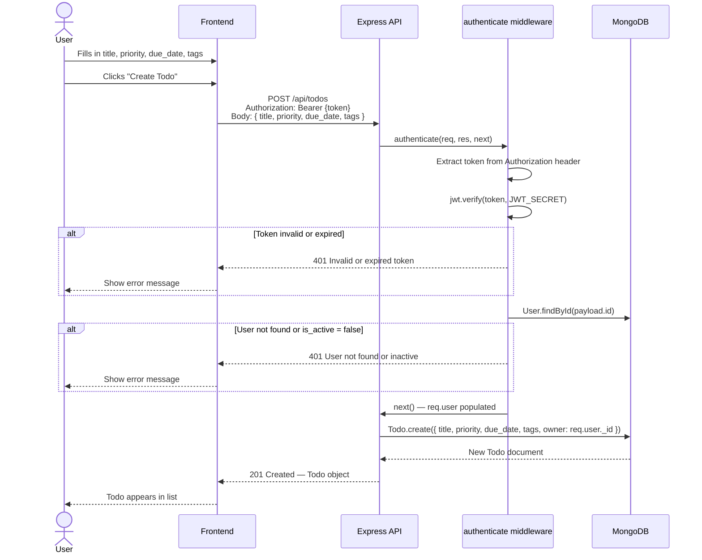

# Diagram: Todo Creation Flow

> **Status:** APPROVED
> **Artefact ID:** `2026-04-10-todo-creation-flow-DIA`
> **Type:** Sequence
> **Linked artefact:** [2026-04-10-due-date-reminders-TIP](../implementation/2026-04-10-due-date-reminders-TIP.md)
> **Author:** Claude (AI) — **Verified by:** (placeholder — Dev Lead to confirm)
> **Date:** 2026-04-10

---

## Purpose

This diagram shows the end-to-end flow of a todo creation request — from the user submitting the form in the frontend, through JWT authentication middleware, to the MongoDB write and the response returned to the client. It is intended for new developers onboarding to the codebase and QA engineers writing integration tests.

---

## Diagram

---

## Key

- **Actor (User)** — the authenticated member interacting with the browser UI
- **Frontend** — React client, calls `POST /api/todos` via `api/todos.js`
- **Express API** — `backend/routes/todos.js` route handler
- **authenticate middleware** — `backend/middleware/auth.js`, runs before every protected route
- **MongoDB** — Mongoose `Todo` model, `backend/models/Todo.js`

---

## Notes & Assumptions

- The `tags` field is an array of existing Tag `_id` values. Tag creation is a separate flow — this diagram assumes tags already exist.
- `assigned_to` is an optional field not shown here for clarity — it follows the same path as other optional body fields.
- Error handling for missing `title` (required field) is enforced by Mongoose schema validation at the `Todo.create` step — a 500 would be returned if `title` is absent; a separate validation middleware step should be added (see open items in BRD).
- The `completed_at` field is not set on creation — only populated when `status` is set to `completed` via `PATCH /api/todos/:id` or `POST /api/todos/:id/complete`.

---

## Revision History

| Version | Date       | Author      | Summary         |
|---------|------------|-------------|-----------------|
| 1.0     | 2026-04-10 | Claude (AI) | Initial diagram |
