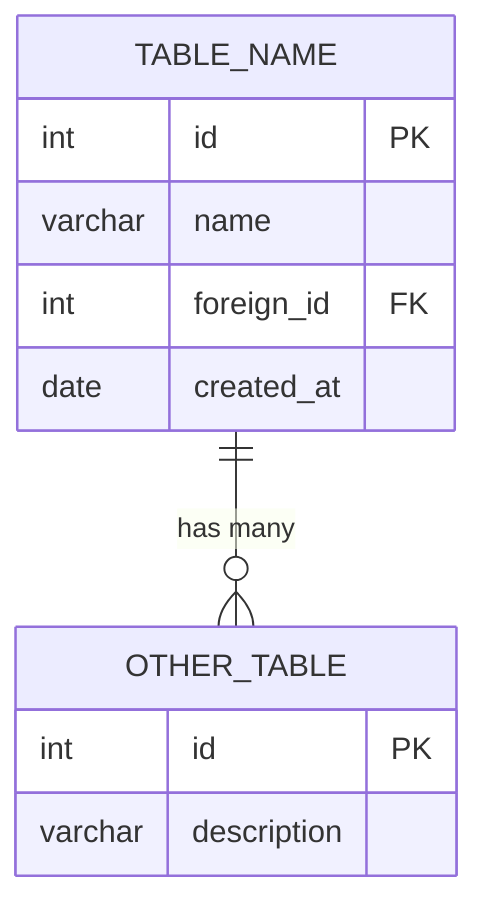

# ERD: {Title}

> **Status:** DRAFT | IN REVIEW | APPROVED
> **Artefact ID:** `{YYYY-MM-DD}-{title-slug}-ERD`
> **Linked artefact:** [{linked BRD, CR, or TIP filename}](../../path/to/artefact.md)
> **Author:** Claude (AI) — **Verified by:** {Name / Role}
> **Date:** {YYYY-MM-DD}

---

## Purpose

{1–2 sentences: which tables are shown, why this diagram was created, and who the intended audience is.}

---

## Diagram

---

## Relationship Key

| Notation | Meaning |
|----------|---------|
| `\|\|--\|\|` | Exactly one to exactly one |
| `\|\|--o{` | One to zero or many |
| `\|\|--\|{` | One to one or many |
| `}o--o{` | Zero or many to zero or many |

---

## Notes & Assumptions

- {Any tables or columns omitted for clarity}
- {Any relationships that differ from the default FK behaviour}

---

## Revision History

| Version | Date         | Author      | Summary         |
|---------|--------------|-------------|-----------------|
| 1.0     | {YYYY-MM-DD} | Claude (AI) | Initial ERD     |
