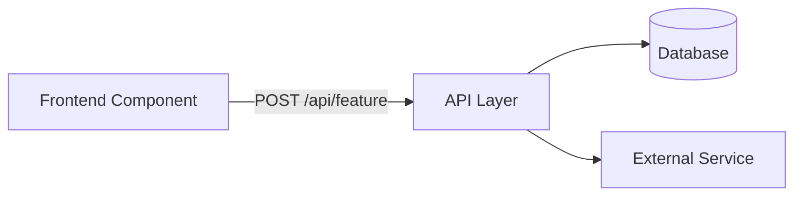

# Technical Implementation Plan (TIP)

> **Status:** DRAFT | IN REVIEW | APPROVED
> **Artefact ID:** `{YYYY-MM-DD}-{feature-slug}-TIP`
> **Feature:** {Feature Title}
> **Module:** {Module Name}
> **Linked BRD:** [{BRD filename}](../requirements/{BRD-filename}.md)
> **Author:** Claude (AI) — Human Verified
> **Verified by:** {Dev Lead / Tech Lead name}
> **Date:** {YYYY-MM-DD}
> **Version:** 1.0

---

## 1. Summary

{2–3 sentences describing what this TIP covers. State the key technical changes at a high level so any developer can understand the scope in 30 seconds.}

**Estimated effort:** {S = <1 day | M = 1–3 days | L = 3–7 days | XL = >7 days}
**Target release:** {Sprint / Release milestone}
**Dependencies:** {List blocking items or other features that must land first, or "None"}

---

## 2. Architecture Overview

{Describe the technical approach at a system level. Use a Mermaid diagram if the data flow or component interaction is non-trivial.}



{Describe the diagram in 2–3 sentences if included.}

---

## 3. Implementation Tasks

{Group tasks by layer. Each task must implement one or more FRs from the linked BRD.}

### 3.1 Backend

| # | Task | FR(s) | Effort | Notes |
|---|---|---|---|---|
| BE-01 | {Description of backend change} | FR-01 | S | |
| BE-02 | {Description} | FR-02, FR-03 | M | |
| BE-03 | {Data migration / seed} | FR-01 | S | Only required if schema changes exist |

### 3.2 API

| # | Task | FR(s) | Effort | Notes |
|---|---|---|---|---|
| API-01 | {Endpoint to create/modify} | FR-01 | S | See API contracts below |
| API-02 | | | | |

### 3.3 Frontend

| # | Task | FR(s) | Effort | Notes |
|---|---|---|---|---|
| FE-01 | {Component/page to create or modify} | FR-01, UI-01 | M | |
| FE-02 | {Form validation} | FR-02, AC-02-01 | S | |
| FE-03 | {Error state UI} | UI-03 | S | |

### 3.4 Infrastructure / Configuration

| # | Task | FR(s) | Effort | Notes |
|---|---|---|---|---|
| INF-01 | {Environment variable, feature flag, or config change} | — | S | |

---

## 4. API Contracts

{One block per new or modified endpoint.}

### `POST /api/{module}/{endpoint}`

**Purpose:** {What this endpoint does}
**Auth:** JWT Bearer — minimum role: {Provider / Manager / Admin}

**Request body:**
```json
{
  "field_name": "string",
  "another_field": true,
  "date_field": "YYYY-MM-DD"
}
```

**Success response — 201 Created:**
```json
{
  "id": "uuid",
  "status": "draft",
  "created_at": "ISO8601"
}
```

**Error responses:**

| Code | Condition | Response body |
|---|---|---|
| 400 | Missing mandatory field | `{"error": "field_name is required"}` |
| 401 | Unauthenticated | `{"error": "Unauthorised"}` |
| 403 | Insufficient role | `{"error": "Forbidden"}` |
| 409 | Conflict (duplicate) | `{"error": "Record already exists"}` |

---

## 5. Data Model Changes

{Complete this section only if schema changes are required. If no changes, write "No data model changes required."}

### New table: `{table_name}`

| Column | Type | Nullable | Default | Constraint |
|---|---|---|---|---|
| `id` | UUID | No | gen_random_uuid() | PK |
| `{field}` | VARCHAR(255) | No | — | FK → {other_table}.id |
| `{field}` | TEXT | Yes | NULL | |
| `created_at` | TIMESTAMPTZ | No | NOW() | |
| `updated_at` | TIMESTAMPTZ | No | NOW() | |

**Indexes:** {List non-PK indexes and their rationale}
**Migration required:** Yes — add migration script `{YYYY-MM-DD}-{description}.sql`

---

## 6. Risks & Mitigations

| # | Risk | Likelihood | Impact | Mitigation |
|---|---|---|---|---|
| R-01 | {Risk description} | High / Medium / Low | High / Medium / Low | {What to do about it} |
| R-02 | | | | |

---

## 7. Open Questions

{Items needing a decision before implementation begins. Assign an owner.}

| # | Question | Owner | Target date | Status |
|---|---|---|---|---|
| OQ-01 | [DEV DECISION REQUIRED] {Question} | Dev Lead | {YYYY-MM-DD} | Open |

---

## 8. Testing Considerations

{Note any specific test conditions that arise from the implementation (e.g. race conditions, cache invalidation, permission boundary cases). This informs the QA team's test plan.}

- {Test consideration}
- {Test consideration}

**Linked test suite:** [{Module} Test Suite](../test-suites/{MODULE}/)

---

## 9. Revision History

| Version | Date | Author | Summary |
|---|---|---|---|
| 1.0 | {YYYY-MM-DD} | Claude (AI) | Initial draft from BRD |
| 1.1 | | Dev Lead | Review and approval |
